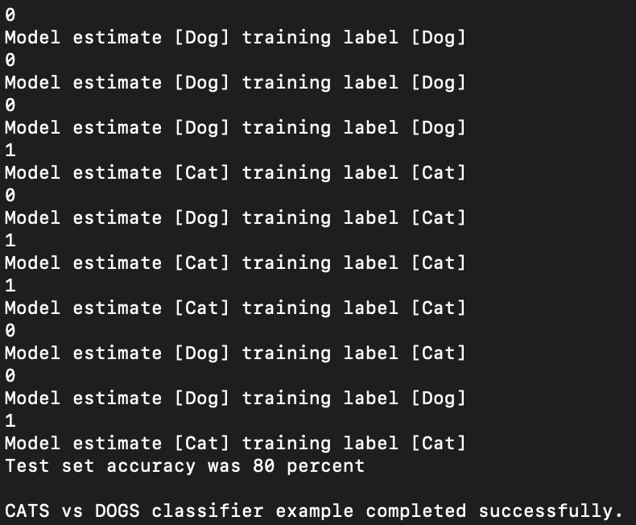

# CATS_VS_DOGS_CNN_TF_Lite_Micro

**Remarque: Le modèle défini dans le notebook du dépôt ne correspond pas au modèle utilisé pour la version TF Lite Micro.**

## Tester le projet

Afin de tester le projet, il faut suivre les instructions suivantes:

1. Cloner le dépot Github de Tensorflow via la commande suivante: git clone https://github.com/tensorflow/tensorflow-master
1. Ajouter le dossier **cats_vs_dogs** de ce projet dans le répertoire **tensorflow-master/tensorflow/lite/micro/examples**
1. Placez vous ensuite dans le répertoire **tensorflow-master** et exécutez la commande suivante, qui créera un fichier binaire **micro_cats_vs_dogs** du projet :
  1. **make -f tensorflow/lite/micro/tools/make/Makefile micro_cats_vs_dogs**
1. Ensuite exécutez la commande suivante, en remplaçant le répertoire **votre_version**:
  **tensorflow/lite/micro/tools/make/gen/<votre_version>/bin/micro_cats_vs_dogs**.
  En éxécutant le fichier binaire, vous devriez voir les prédictions faites par le modèle pour les données du fichier **cats_vs_dogs_data.h** et la précision de notre modèle. Cela s'affiche de la façon suivante:
  
